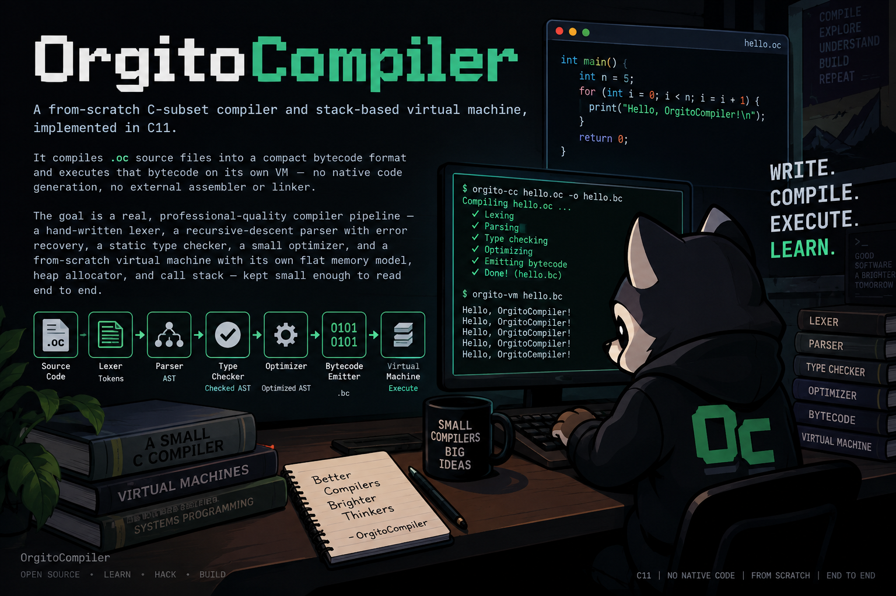

# OrgitoCompiler



**OrgitoCompiler** is a from-scratch C-subset compiler and stack-based
virtual machine, implemented in C11.

It compiles `.oc` source files into a compact bytecode format and executes
that bytecode on its own VM — no native code generation, no external
assembler or linker. The goal is a **real, professional-quality compiler
pipeline** — a hand-written lexer, a recursive-descent parser with error
recovery, a static type checker, a small optimizer, and a from-scratch
virtual machine with its own flat memory model, heap allocator, and call
stack — kept small enough to read end to end.

> OrgitoCompiler does **not** implement the full C language, and it isn't
> trying to compete with GCC/Clang. It supports a substantial, coherent
> subset: real types (including pointers, arrays, and structs), a static
> type checker, first-class strings, a tiny standard library, and a
> `#include` preprocessor for multi-file programs.

---

## 1. Language overview

Every `.oc` program consists of top-level `struct` declarations, global
variables, and function declarations, and execution always starts at
`int main()`.

```c
#include "shapes.oc"

int counter = 0;

struct Point {
    int x;
    int y;
};

int distance_sq(struct Point a, struct Point b) {
    int dx = a.x - b.x;
    int dy = a.y - b.y;
    return dx * dx + dy * dy;
}

int main() {
    struct Point origin;
    origin.x = 0;
    origin.y = 0;

    struct Point p;
    p.x = 3;
    p.y = 4;

    print(distance_sq(origin, p));   // 25
    print("done");
    return 0;
}
```

### Types

| Type | Size | Notes |
|---|---|---|
| `void` | — | only valid as a return type or `void*` |
| `bool` | 1 byte | `true`/`false` literals, a real distinct type |
| `char` | 1 byte | numeric like C's `char`; also used for string bytes |
| `int` | 4 bytes | |
| `long` | 8 bytes | numeric literals suffixed `L` (`100L`), or auto-widened if too large for `int` |
| `float` | 4 bytes | literals suffixed `f` (`1.5f`) |
| `double` | 8 bytes | any decimal-point or exponent literal without `f` |
| `T*` | 4 bytes | pointer to `T`, any number of `*` (`int**`, ...) |
| `T[N]` | `N * sizeof(T)` | fixed-size array; decays to `T*` when passed to a function or otherwise used as a value |
| `struct Name` | sum of members (aligned) | user-defined, must be fully defined before first use |

Numeric conversions follow ordinary C-like promotion (`bool`/`char`/`int`
→ `long` → `float` → `double`, widest wins) and are inserted automatically
wherever a value is assigned, passed, returned, or compared against a
different-but-compatible numeric type. Every other conversion needs an
explicit cast: `(type)expr`.

### Expressions

- Arithmetic `+ - * / %`, comparisons `< > <= >= == !=`, logical `&& || !`
  (short-circuiting), unary `-`.
- Pointers: `&expr` (address-of, `expr` must be an lvalue), `*expr`
  (dereference), pointer arithmetic (`p + 1` advances by `sizeof(*p)`
  bytes), pointer comparisons, and `p - q` between two pointers into the
  same array (yields a `long` element count).
- Arrays: `arr[index]` (bounds-checked when `arr` is a directly-named
  array of known size; unchecked, like real C, when indexing through a
  general pointer).
- Structs: `s.field`, `p->field`.
- Casts: `(type)expr` between numeric types, and between pointer types
  (including pointer ↔ integer reinterpretation).
- `sizeof(type)` or `sizeof expr` — always a compile-time constant `long`.
- String literals `"..."` are ordinary `char*` expressions now: assignable,
  passable, comparable, printable — not restricted to `print(...)` the way
  the very first prototypes of this project were.

### Statements

`type name (= expr)? ;` declarations (locals are always either explicitly
initialized or zero-initialized — never garbage), assignment `lvalue = expr;`,
compound assignment (`+= -= *= /= %=`), `++`/`--` (statement-only, not
usable inside a larger expression), `if`/`else`, `while`, `for`,
`switch`/`case`/`default` (with real C fallthrough — use `break;` to stop
it), `break`, `continue`, `return`, and `{ }` blocks with lexical scoping
and shadowing.

### Functions

```c
int add(int a, int b) { return a + b; }
struct Point make_point(int x, int y) { struct Point p; p.x = x; p.y = y; return p; }
void bump(struct Point *p) { p->x = p->x + 1; }
int sum(int arr[], int n) { int t = 0; for (int i = 0; i < n; i++) t += arr[i]; return t; }
```

Struct parameters and struct returns are real **by-value copies** (not
aliases) — mutating a copy never affects the caller's original. Array
parameters decay to a pointer, exactly like real C. Declaration order
doesn't matter (all function signatures are resolved before any body is
compiled), so mutual recursion and forward references just work.

### The standard library (built in, no header needed)

| Function | Signature | Notes |
|---|---|---|
| `print` | `print(a, b, ...)` → `void` | prints every argument back-to-back, then one newline; accepts any scalar type or `char*` string |
| `malloc` | `malloc(long size)` → `void*` | heap allocation; returns `NULL` on failure |
| `free` | `free(void* ptr)` → `void` | freeing an already-freed or invalid pointer is a fatal runtime error, never silent corruption |
| `strlen` | `strlen(char* s)` → `int` | |
| `strcmp` | `strcmp(char* a, char* b)` → `int` | |
| `strcpy` | `strcpy(char* dst, char* src)` → `char*` | returns `dst` |

### Multi-file programs

```c
#include "lib.oc"
```

A textual, recursive `#include` (the directive must be the first thing on
its line; the path is resolved relative to the file containing the
directive). Include cycles are rejected with the full cycle shown; a
missing file is reported against the line that tried to include it.
Diagnostics from an included file report *that file's* name and line, not
the merged line number.

---

## 2. Diagnostics

Unlike a "stop at the first error" compiler, OrgitoCompiler's lexer,
parser, and type checker all keep going after a problem, so **one run can
report every independent mistake in a file**:

```text
tests/errors/err_multi.oc:15:13: error: use of undeclared identifier 'y'
    int x = y;
            ^
tests/errors/err_multi.oc:17:12: error: struct 'Point' has no member 'z'
    print(p.z);
           ^
tests/errors/err_multi.oc:18:14: error: 'add' expects 2 arguments, got 3
    print(add(1, 2, 3));
             ^
```

Warnings (unused variables, unreachable code, falling off the end of a
non-void function) are reported the same way but don't fail the build
unless `-Werror` is passed. Runtime errors from the VM (null dereference,
out-of-bounds access, division by zero, stack overflow, double free, ...)
are always fatal and never silently corrupt memory or crash the host
process uncontrolled — they're reported as `VM error: ...` and exit with
status 2.

Exit code convention: `0` success, `1` a compile-time error (or a warning
under `-Werror`), `2` a runtime error from the VM.

---

## 3. Architecture

```
source.oc → preprocess → lex → parse → typecheck → optimize(AST)
          → codegen → optimize(bytecode) → execute
```

| Module | Responsibility |
|---|---|
| `preprocess.c` | Expands `#include`, builds a `SourceMap` so every later diagnostic can point at the real originating file/line |
| `lexer.c` | Hand-written tokenizer; reports and skips bad characters/literals instead of aborting |
| `ast.c` | The typed AST — expressions, statements, structs, globals, functions |
| `parser.c` | Recursive-descent parser with panic-mode recovery (resyncs to the next statement/declaration boundary on a syntax error, so one run can report several) |
| `types.c` | The type system: primitives, pointers, arrays, structs, `sizeof`/layout, assignability/cast rules |
| `typecheck.c` | Resolves every identifier, annotates every expression with its `Type*`, enforces every compatibility rule, emits warnings |
| `optimize.c` | AST constant folding + dead-code elimination, and a bytecode peephole pass (jump-to-jump collapsing) |
| `codegen.c` | Lowers the AST to bytecode: a flat `int32` instruction stream plus constant pools (`i64`/`f64`/functions) and a compile-time-built static data segment |
| `vm.c` | Executes the bytecode |
| `main.c` | CLI driver |

### The virtual machine

The VM's entire addressable state is one flat byte array
(`memory[16 MiB]`), split into four regions:

```
[guard][ static/global data | string literals ][   heap   ][   call stack   ]
  64B          2 MiB                              6 MiB          ~8 MiB
```

- **Pointers are plain 32-bit offsets into this array** (`0` is NULL and
  is never a valid address), which is why every pointer, bytecode operand,
  and `Value` payload fits in one machine word — no separate "wide
  pointer" encoding was needed anywhere in the design.
- The **operand stack** used for expression evaluation holds tagged
  `Value` cells (`{ tag; union { bool, char, int32, int64, float, double,
  ptr } as; }`), so arithmetic/comparison opcodes stay generic (one
  `BC_ADD`, one `BC_LT`, ...) and dispatch on the runtime tag instead of
  needing a whole family of type-specific opcodes.
- **Locals are addressable memory, not slot indices.** Every function call
  gets a contiguous, byte-sized frame carved out of the stack region (bump
  allocated, freed on return), so `&local_var` is a real, stable address —
  which is what makes pointers, `&struct_field`, and passing arrays by
  reference all work uniformly.
- **`malloc`/`free`** are backed by a real first-fit free-list allocator
  living in the heap region; `free()` of an address that isn't a live
  allocation is a fatal error, not silent corruption.
- **Struct-by-value** parameters and returns use the classic
  caller-allocated **sret** convention (a hidden destination pointer) —
  no bytecode changes were needed to support it, since the calling
  convention already treated a struct argument as "here's an address,
  `memcpy` it into the frame."
- Every memory access is bounds-checked against the whole address space
  (so a wild pointer is a controlled `VM error`, never a host segfault);
  indexing a **named array directly** additionally gets a tight,
  compile-time-known-length bounds check with the same
  `"array index out of bounds"` message this project has always used.

Run `orgitoc --emit-bytecode file.oc` to see the compiled instruction
stream and function table directly, or `--emit-ast` to see the parsed
(and, with `-O1`, constant-folded) AST.

---

## 4. Grammar

```
program      := top_decl*
top_decl     := struct_decl | global_decl | funcdecl

struct_decl  := 'struct' IDENT '{' member_decl+ '}' ';'
member_decl  := type_name IDENT array_suffix? ';'
array_suffix := '[' const_expr ']'

global_decl  := type_name IDENT array_suffix? ('=' const_expr)? ';'
funcdecl     := type_name IDENT '(' params? ')' '{' stmt* '}'
params       := 'void' | param (',' param)*
param        := type_name IDENT array_suffix?        -- array param decays to pointer

type_name    := base_type '*'*
base_type    := 'void' | 'bool' | 'char' | 'int' | 'long' | 'float' | 'double'
             |  'struct' IDENT

stmt         := type_name IDENT array_suffix? ('=' expr)? ';'
             |  lvalue '=' expr ';'
             |  lvalue ('+='|'-='|'*='|'/='|'%=') expr ';'
             |  lvalue ('++' | '--') ';'  |  ('++' | '--') lvalue ';'
             |  expr ';'
             |  'if' '(' expr ')' stmt ('else' stmt)?
             |  'while' '(' expr ')' stmt
             |  'for' '(' forinit? ';' expr? ';' simple? ')' stmt
             |  'switch' '(' expr ')' '{' case_clause* '}'
             |  'break' ';'  |  'continue' ';'
             |  'return' expr? ';'
             |  '{' stmt* '}'
forinit      := type_name IDENT '=' expr | simple
simple       := lvalue '=' expr | lvalue ('+='|'-='|'*='|'/='|'%=') expr
             |  lvalue ('++'|'--') | ('++'|'--') lvalue | expr
case_clause  := ('case' const_expr ':' | 'default' ':') stmt*
lvalue       := unary   -- restricted at typecheck time to var/*e/e[e]/e.m/e->m

expr         := logic_or
logic_or     := logic_and ('||' logic_and)*
logic_and    := equality  ('&&' equality)*
equality     := relational (('=='|'!=') relational)*
relational   := additive  (('<'|'>'|'<='|'>=') additive)*
additive     := term (('+'|'-') term)*
term         := cast_expr (('*'|'/'|'%') cast_expr)*
cast_expr    := '(' type_name ')' cast_expr | unary
unary        := ('-'|'!'|'*'|'&') unary
             |  'sizeof' '(' type_name ')' | 'sizeof' unary
             |  postfix
postfix      := primary ( '[' expr ']' | '.' IDENT | '->' IDENT | '(' args? ')' )*
primary      := NUMBER | LONG_NUMBER | FLOAT_NUMBER | DOUBLE_NUMBER | CHAR_LITERAL
             |  STRING | 'true' | 'false' | 'NULL' | IDENT | '(' expr ')'
args         := expr (',' expr)*
const_expr   := expr    -- must fold to a compile-time constant
```

Preprocessing (`#include`) happens before any of the above: a line whose
first non-space text is `#include "path"` is replaced by that file's
(recursively preprocessed) contents.

---

## 5. Build instructions

### Requirements

- A C11 compiler (`gcc` or `clang`) and `make`.
- On Windows, build inside WSL or any POSIX-like environment — the project
  uses `realpath`/`GetFullPathNameA` for `#include` path resolution and
  has no other platform-specific code.

### Steps

```bash
make
```

This produces `bin/orgitoc`.

---

## 6. Usage

```bash
bin/orgitoc [options] <file.oc>
```

| Option | Effect |
|---|---|
| `-O0` | disable optimizations |
| `-O1` | constant folding, dead-code elimination, bytecode peephole cleanup (**default**) |
| `-Wall` | show warnings (default; this flag is a no-op today, kept for familiarity) |
| `-Werror` | treat warnings as compile errors |
| `--emit-ast` | print the parsed/optimized AST and exit (no codegen or execution) |
| `--emit-bytecode` | print a disassembly of the compiled bytecode and exit (no execution) |
| `-h`, `--help` | usage |

```bash
bin/orgitoc examples/hello.oc
bin/orgitoc --emit-bytecode examples/structs.oc
bin/orgitoc -O0 -Werror examples/globals.oc
```

---

## 7. Examples

The `examples/` directory has one focused program per major feature:
`hello.oc` (a gentle first program), `structs.oc`, `pointers.oc`,
`arrays_sizeof.oc`, `malloc_free.oc`, `strings.oc`, `switch.oc`,
`casts.oc`, `globals.oc`, and `include_main.oc`/`include_lib.oc` (a
multi-file program).

---

## 8. Running tests

```bash
make test
```

or directly:

```bash
./tests/run_tests.sh
```

The suite checks: every example's exact output, that `-O0` and `-O1`
produce identical program behavior, that `-O1` measurably shrinks an
obviously-foldable program's bytecode, a handful of deliberately-invalid
programs (each expecting a *specific* error message — including one file
with three independent, unrelated mistakes, proving errors are collected
rather than stopping at the first), a warnings-only program that must
still exit successfully, and `--emit-ast`/`--emit-bytecode` smoke tests.

---

## 9. Known limitations

Deliberate scope cuts, not oversights: no bitwise operators, no unions or
function pointers, no `typedef`, no preprocessor macros beyond
`#include`, no separate compilation/linking (`#include` is purely
textual), assignment is statement-only (not a chainable expression like
`a = b = c`), and structs must be fully defined before first use (no
forward declarations). None of these affect the language's soundness —
they're places where "a real, coherent C subset" was chosen over "as much
of C as possible."

## License

Treat this as an educational reference implementation and adapt it freely
for your own projects or teaching material. If you publish it, consider
adding a standard open-source license (e.g. MIT) and crediting the
project name **OrgitoCompiler**.
